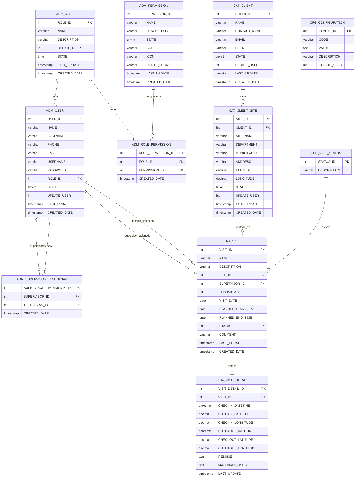

# Base de Datos - Sistema de Gestión de Visitas

## Diagrama Entidad-Relación

## Descripción de las Entidades

### 1. **Módulo de Administración (ADM)**

#### ADM_ROLE
Catálogo de roles del sistema que define los diferentes tipos de usuarios.
- **Campos principales**: 
  - `ROLE_ID`: Identificador único del rol
  - `NAME`: Nombre del rol (Administrador, Supervisor, Técnico)
  - `DESCRIPTION`: Descripción del rol
  - `STATE`: Estado del rol (1=Activo, 0=Inactivo)

#### ADM_PERMISSION
Catálogo de permisos del sistema que define las acciones disponibles.
- **Campos principales**:
  - `PERMISSION_ID`: Identificador único del permiso
  - `NAME`: Nombre del permiso
  - `CODE`: Código único utilizado en el backend
  - `ICON`: Ícono asociado al permiso
  - `ROUTE_FRONT`: Ruta de frontend asociada

#### ADM_ROLE_PERMISSION
Tabla de relación muchos a muchos entre roles y permisos.
- **Propósito**: Asignar múltiples permisos a cada rol

#### ADM_USER
Registro de usuarios del sistema.
- **Campos principales**:
  - `USER_ID`: Identificador único del usuario
  - `NAME`, `LASTNAME`: Datos personales del usuario
  - `USERNAME`, `PASSWORD`: Credenciales de acceso
  - `ROLE_ID`: Rol asignado (FK a ADM_ROLE)
  - `STATE`: Estado del usuario (0=Inactivo, 1=Activo, 2=Cambiar password)

#### ADM_SUPERVISOR_TECHNICIAN
Relación entre supervisores y técnicos asignados.
- **Propósito**: Un supervisor puede tener múltiples técnicos asignados

### 2. **Catálogos (CAT)**

#### CAT_CLIENT
Catálogo de clientes del sistema.
- **Campos principales**:
  - `CLIENT_ID`: Identificador único del cliente
  - `NAME`: Nombre de la empresa cliente
  - `CONTACT_NAME`: Nombre de la persona de contacto
  - `EMAIL`, `PHONE`: Datos de contacto

#### CAT_CLIENT_SITE
Catálogo de sitios/sedes de los clientes.
- **Campos principales**:
  - `SITE_ID`: Identificador único del sitio
  - `CLIENT_ID`: Cliente propietario (FK a CAT_CLIENT)
  - `SITE_NAME`: Nombre del sitio
  - `DEPARTMENT`, `MUNICIPALITY`: Ubicación geográfica
  - `LATITUDE`, `LONGITUDE`: Coordenadas GPS para geolocalización

### 3. **Transacciones (TRA)**

#### TRA_VISIT
Registro principal de visitas técnicas.
- **Campos principales**:
  - `VISIT_ID`: Identificador único de la visita
  - `NAME`, `DESCRIPTION`: Información descriptiva de la visita
  - `SITE_ID`: Sitio a visitar (FK a CAT_CLIENT_SITE)
  - `SUPERVISOR_ID`: Supervisor responsable (FK a ADM_USER)
  - `TECHNICIAN_ID`: Técnico asignado (FK a ADM_USER)
  - `VISIT_DATE`: Fecha programada
  - `PLANNED_START_TIME`, `PLANNED_END_TIME`: Horario planificado
  - `STATUS`: Estado actual (FK a CFG_VISIT_STATUS)

#### TRA_VISIT_DETAIL
Detalle operativo de cada visita técnica.
- **Campos principales**:
  - `VISIT_ID`: Visita asociada (FK a TRA_VISIT)
  - `CHECKIN_DATETIME`, `CHECKOUT_DATETIME`: Tiempos reales de inicio y fin
  - `CHECKIN_LATITUDE/LONGITUDE`, `CHECKOUT_LATITUDE/LONGITUDE`: Ubicación GPS
  - `RESUME`: Resumen del trabajo realizado
  - `MATERIALS_USED`: Materiales utilizados

### 4. **Configuraciones (CFG)**

#### CFG_VISIT_STATUS
Catálogo de estados de las visitas técnicas.
- **Estados disponibles**:
  1. Programada
  2. En camino
  3. Iniciada
  4. Completada
  5. Cancelada

#### CFG_CONFIGURATION
Configuraciones generales del sistema.
- **Propósito**: Almacenar queries SQL, configuraciones de correo, endpoints, etc.

## Relaciones Principales

### Flujo de Visitas Técnicas
1. **Cliente** tiene múltiples **Sitios**
2. **Supervisor** crea **Visita** asignando un **Técnico**
3. **Técnico** realiza check-in/check-out en el **Sitio**
4. Se genera **Detalle de Visita** con información operativa

### Flujo de Permisos
1. **Usuario** tiene un **Rol**
2. **Rol** tiene múltiples **Permisos**
3. **Permisos** definen acceso a módulos y funciones

### Jerarquía Organizacional
1. **Administrador**: Acceso completo al sistema
2. **Supervisor**: Gestiona técnicos y visitas
3. **Técnico**: Ejecuta visitas asignadas

## Características de Seguridad

- **Encriptación**: Contraseñas encriptadas con bcrypt
- **Estados de Usuario**: Control de activación y cambio de contraseña
- **Auditoría**: Campos de auditoría en todas las tablas principales
- **Geolocalización**: Tracking GPS de check-in/check-out

## Procedimientos Almacenados

### SP_CANCELAR_VISITAS_VENCIDAS
Procedimiento que automaticamente cancela visitas con estados 1, 2 o 3 cuya fecha ya haya pasado.

## Notas Técnicas

- **Motor de BD**: MySQL 8.0.42
- **Codificación**: utf8mb4_0900_ai_ci
- **Zona Horaria**: Manejo de UTC con conversión a GMT-6
- **Integridad**: Claves foráneas con restricciones CASCADE
- **Indexación**: Índices en claves foráneas para optimización

## Scripts de Inicialización

El script de base de datos incluye:
- Estructura completa de tablas
- Datos de configuración inicial
- Procedimientos almacenados
- Configuraciones de sistema