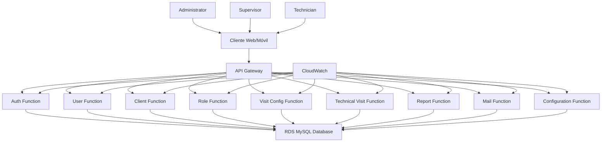
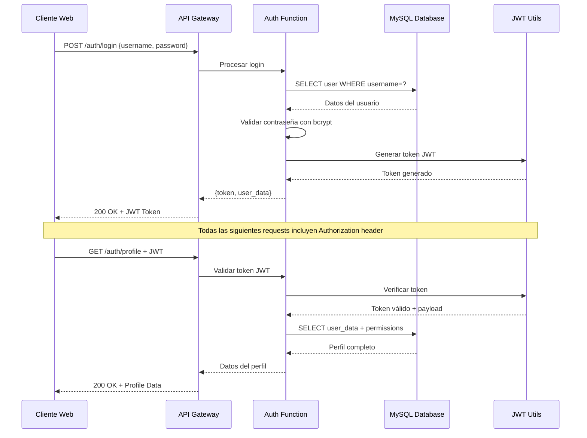
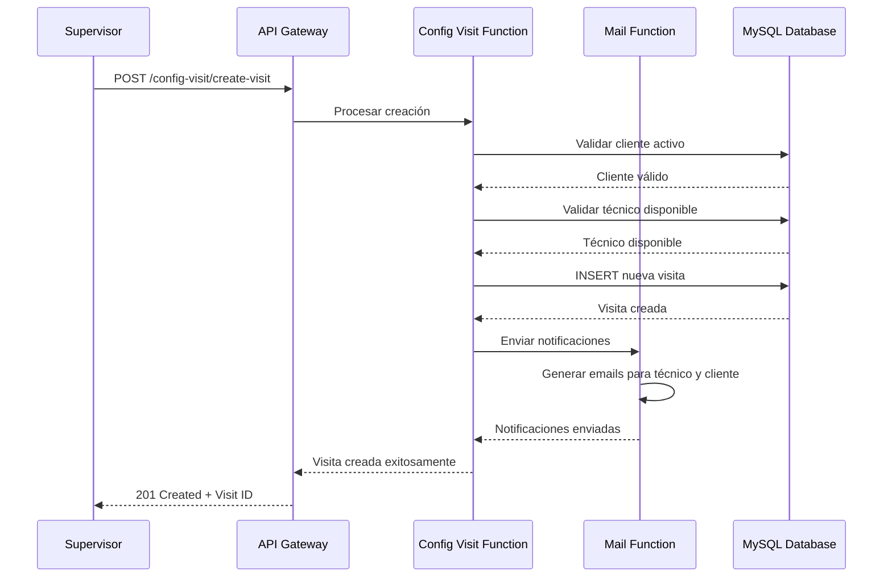
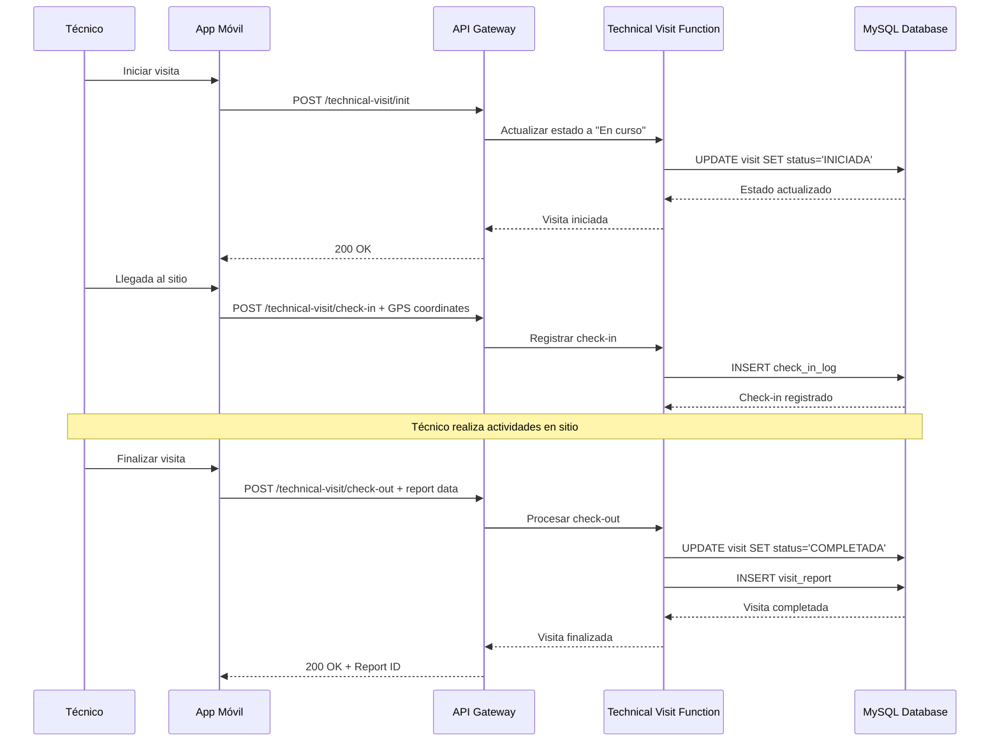

# Sistema de Gestión de Visitas Técnicas

## Índice

1. [Resumen Ejecutivo](#resumen-ejecutivo)
2. [Objetivos Estratégicos](#objetivos-estratégicos)
3. [Tecnologías Utilizadas](#tecnologías-utilizadas)
4. [Arquitectura General](#arquitectura-general)
5. [Estructura del Proyecto](#estructura-del-proyecto)
6. [API Endpoints](#api-endpoints)
7. [Casos de Uso](#casos-de-uso)
8. [Flujos de Secuencia](#flujos-de-secuencia)
9. [Pruebas](#pruebas)
10. [Instalación y Ejecución Local](#instalación-y-ejecución-local)

---

## Resumen Ejecutivo

### Propósito
Sistema web integral para la gestión y seguimiento de visitas técnicas a sitios de clientes, optimizando la coordinación entre supervisores, técnicos y administradores.

### Valor Estratégico
- **Optimización de recursos**: Mejor asignación de técnicos a visitas
- **Trazabilidad completa**: Seguimiento en tiempo real de todas las actividades
- **Reportes automáticos**: Generación de informes para toma de decisiones
- **Escalabilidad**: Arquitectura serverless que se adapta a la demanda

### Stakeholders
- **Administradores**: Gestión completa del sistema y usuarios
- **Supervisores**: Coordinación y asignación de visitas técnicas
- **Técnicos**: Ejecución y reporte de visitas en campo
- **Clientes**: Beneficiarios finales del servicio técnico

### Estado Actual
**Producción** - Sistema desplegado en AWS con arquitectura de microservicios

---

## Objetivos Estratégicos

### Problemas que Resuelve
- **Descoordinación en visitas técnicas**: Evita conflictos de horarios y sobreposición de recursos
- **Falta de trazabilidad**: Elimina la pérdida de información sobre el estado de las visitas
- **Gestión manual de reportes**: Automatiza la generación de informes y métricas
- **Control de acceso deficiente**: Implementa un sistema robusto de roles y permisos

### Beneficios
- **Eficiencia operativa**: Reducción del 40% en tiempo de coordinación
- **Visibilidad**: Dashboard en tiempo real del estado de operaciones
- **Seguridad**: Autenticación JWT y control de acceso basado en roles
- **Movilidad**: API REST compatible con aplicaciones móviles

### Objetivos
1. **Gestión centralizada** de usuarios, roles y permisos
2. **Coordinación eficiente** de visitas técnicas
3. **Seguimiento en tiempo real** del progreso de visitas
4. **Generación automática** de reportes y métricas

### Resultados Esperados
- 95% de disponibilidad del sistema
- Reducción del 60% en errores de coordinación
- Tiempo de respuesta < 200ms para operaciones críticas
- Incremento del 30% en productividad del equipo técnico

---

## Tecnologías Utilizadas

### Backend Framework
- **Node.js 22.x** - Runtime principal
- **TypeScript** - Lenguaje de desarrollo
- **Express.js** - Framework web
- **ESBuild** - Compilador y bundler optimizado

### Librerías Principales
- **bcryptjs** - Encriptación de contraseñas
- **jsonwebtoken** - Autenticación JWT
- **mysql2** - Driver de base de datos MySQL
- **cors** - Manejo de CORS
- **express-rate-limit** - Limitación de tasa de peticiones

### Servicios AWS Clave
- **AWS Lambda** - Funciones serverless
- **API Gateway** - Gateway de APIs REST
- **RDS MySQL** - Base de datos relacional
- **CloudFormation** - Infraestructura como código
- **SAM CLI** - Deployment y testing local

### DevOps y Deployment
- **AWS SAM** - Serverless Application Model
- **CloudWatch** - Monitoreo y logs
- **IAM** - Gestión de identidades y accesos

---

## Arquitectura General

### Descripción de Componentes
El sistema utiliza una arquitectura de microservicios serverless donde cada función Lambda maneja un dominio específico del negocio, comunicándose a través de API Gateway y compartiendo una base de datos MySQL centralizada.

### Diagrama de Contexto



### Componentes Principales

| Componente | Responsabilidad | Tecnología |
|------------|----------------|------------|
| **API Gateway** | Punto de entrada único, enrutamiento | AWS API Gateway |
| **Auth Function** | Autenticación, autorización, perfiles | Lambda + Node.js |
| **User Function** | Gestión de usuarios y técnicos | Lambda + Node.js |
| **Client Function** | Gestión de clientes y sitios | Lambda + Node.js |
| **Role Function** | Gestión de roles y permisos | Lambda + Node.js |
| **Visit Functions** | Configuración y ejecución de visitas | Lambda + Node.js |
| **Report Function** | Generación de reportes | Lambda + Node.js |
| **Mail Function** | Notificaciones por email | Lambda + Node.js |
| **Database** | Almacenamiento persistente | RDS MySQL |

---

## Estructura del Proyecto

```
backend/
├── template.yaml              # SAM template - Infraestructura como código
├── samconfig.toml            # Configuración de deployment
├── auth/                     # Microservicio de autenticación
│   ├── src/
│   │   ├── controllers/      # Controladores de autenticación
│   │   ├── services/         # Lógica de negocio
│   │   ├── middlewares/      # Middleware de autenticación
│   │   ├── routes/           # Definición de rutas
│   │   └── utils/            # Utilidades (JWT, etc.)
│   ├── index.ts             # Handler principal de Lambda
│   ├── local-server.ts      # Servidor local para desarrollo
│   └── package.json         # Dependencias del microservicio
├── user/                    # Gestión de usuarios
├── client/                  # Gestión de clientes
├── role/                    # Gestión de roles
├── technical-visit/         # Ejecución de visitas
├── config-visit/           # Configuración de visitas
├── report/                 # Generación de reportes
├── mail/                   # Servicio de notificaciones
└── configurations/         # Configuraciones del sistema
```

### Convenciones de Código
- **Nombres de archivos**: kebab-case para carpetas, camelCase para archivos TypeScript
- **Estructura MVC**: Separación clara entre controllers, services y routes
- **Middleware**: Validación de autenticación y autorización centralizada
- **Error handling**: Manejo consistente de errores con códigos HTTP apropiados

---

## 🔌 API Endpoints

### Autenticación
| Método | Ruta | Descripción | Autenticación |
|--------|------|-------------|---------------|
| POST | `/auth/login` | Login de usuario | ❌ No |
| GET | `/auth/profile` | Obtener perfil del usuario | ✅ JWT |
| POST | `/auth/change-password` | Cambiar contraseña | ✅ JWT |
| GET | `/auth/data-graphs` | Datos para dashboard | ✅ JWT + Permisos |

### Gestión de Usuarios
| Método | Ruta | Descripción | Autenticación |
|--------|------|-------------|---------------|
| GET | `/user/` | Listar todos los usuarios | ✅ JWT |
| GET | `/user/{id}` | Obtener usuario por ID | ✅ JWT |
| GET | `/user/technical/{userId}` | Obtener técnicos asignados | ✅ JWT |
| POST | `/user/save` | Crear nuevo usuario | ✅ JWT |
| PUT | `/user/update` | Actualizar usuario | ✅ JWT |
| PUT | `/user/delete` | Eliminar usuario (soft delete) | ✅ JWT |
| PUT | `/user/reset-password` | Resetear contraseña | ✅ JWT |
| POST | `/user/assign-technical` | Asignar técnico | ✅ JWT |

### Gestión de Clientes
| Método | Ruta | Descripción | Autenticación |
|--------|------|-------------|---------------|
| GET | `/client/` | Listar clientes | ✅ JWT |
| GET | `/client/{id}` | Obtener cliente por ID | ✅ JWT |
| POST | `/client/save` | Crear cliente | ✅ JWT |
| PUT | `/client/update` | Actualizar cliente | ✅ JWT |
| PUT | `/client/delete` | Eliminar cliente | ✅ JWT |
| GET | `/client/sites-by-client/{id}` | Sitios por cliente | ✅ JWT |
| POST | `/client/site/save` | Crear sitio | ✅ JWT |
| PUT | `/client/site/update` | Actualizar sitio | ✅ JWT |

### Gestión de Roles
| Método | Ruta | Descripción | Autenticación |
|--------|------|-------------|---------------|
| GET | `/role/` | Listar roles | ✅ JWT |
| GET | `/role/{id}` | Obtener rol por ID | ✅ JWT |
| GET | `/role/permissions/{roleId}` | Permisos por rol | ✅ JWT |
| POST | `/role/save` | Crear rol | ✅ JWT |
| PUT | `/role/update` | Actualizar rol | ✅ JWT |
| POST | `/role/assign-permission` | Asignar permiso | ✅ JWT |

### Visitas Técnicas
| Método | Ruta | Descripción | Autenticación |
|--------|------|-------------|---------------|
| GET | `/technical-visit/` | Listar visitas | ✅ JWT |
| GET | `/technical-visit/{id}` | Obtener visita por ID | ✅ JWT |
| POST | `/technical-visit/init` | Iniciar visita | ✅ JWT |
| POST | `/technical-visit/check-in` | Check-in en sitio | ✅ JWT |
| POST | `/technical-visit/check-out` | Check-out de sitio | ✅ JWT |

### Configuración de Visitas
| Método | Ruta | Descripción | Autenticación |
|--------|------|-------------|---------------|
| GET | `/config-visit/visit/{id}` | Obtener visita | ✅ JWT |
| GET | `/config-visit/supervisors` | Listar supervisores | ✅ JWT |
| GET | `/config-visit/technicians-by-supervisor/{id}` | Técnicos por supervisor | ✅ JWT |
| POST | `/config-visit/create-visit` | Crear visita | ✅ JWT |
| PUT | `/config-visit/update-visit` | Actualizar visita | ✅ JWT |
| PUT | `/config-visit/cancel-visit` | Cancelar visita | ✅ JWT |

### Reportes
| Método | Ruta | Descripción | Autenticación |
|--------|------|-------------|---------------|
| GET | `/report/rep-users` | Reporte de usuarios | ✅ JWT |
| GET | `/report/rep-clientes` | Reporte de clientes | ✅ JWT |
| GET | `/report/rep-visitas` | Reporte de visitas | ✅ JWT |

### Notificaciones
| Método | Ruta | Descripción | Autenticación |
|--------|------|-------------|---------------|
| POST | `/mail/send` | Enviar notificación email | ✅ JWT |

---

## Casos de Uso

### 1. Gestión de Usuarios
**Actor**: Administrador  
**Objetivo**: Administrar usuarios del sistema  
**Flujo**:
1. Administrador accede al sistema con credenciales
2. Navega a la sección de gestión de usuarios
3. Puede crear, editar, eliminar usuarios
4. Asigna roles y permisos específicos
5. Gestiona reseteo de contraseñas

### 2. Programación de Visitas
**Actor**: Supervisor  
**Objetivo**: Programar visita técnica  
**Flujo**:
1. Supervisor se autentica en el sistema
2. Selecciona cliente y sitio de la visita
3. Asigna técnico disponible
4. Define fecha, hora y detalles de la visita
5. Sistema envía notificaciones automáticas
6. Visita queda registrada en el sistema

### 3. Ejecución de Visita Técnica
**Actor**: Técnico  
**Objetivo**: Ejecutar visita en campo  
**Flujo**:
1. Técnico recibe notificación de visita asignada
2. Realiza check-in al llegar al sitio del cliente
3. Ejecuta las actividades técnicas requeridas
4. Registra observaciones y resultados
5. Realiza check-out al finalizar la visita
6. Sistema actualiza estado y genera reportes

### 4. Generación de Reportes
**Actor**: Supervisor/Administrador  
**Objetivo**: Obtener métricas y reportes  
**Flujo**:
1. Usuario autorizado accede a sección de reportes
2. Selecciona tipo de reporte (usuarios, clientes, visitas)
3. Define filtros y períodos de tiempo
4. Sistema genera reporte en tiempo real
5. Posibilidad de exportar o compartir resultados

### 5. Gestión de Roles y Permisos
**Actor**: Administrador  
**Objetivo**: Configurar control de acceso  
**Flujo**:
1. Administrador accede a configuración de roles
2. Crea o modifica roles existentes
3. Asigna permisos específicos por funcionalidad
4. Asocia usuarios con roles apropiados
5. Sistema aplica permisos en tiempo real

---

## Flujos de Secuencia

### Flujo de Autenticación



### Flujo de Creación de Visita



### Flujo de Ejecución de Visita



---

## Pruebas

### Pruebas Unitarias
```bash
# Ejecutar pruebas unitarias para un microservicio específico
cd auth/
npm test

# Ejecutar pruebas con cobertura
npm run test:coverage
```

### Pruebas de Integración
```bash
# Iniciar todos los servicios localmente
sam local start-api

# Ejecutar pruebas de integración
npm run test:integration
```

### Pruebas End-to-End
```bash
# Desplegar en ambiente de staging
sam deploy --config-env staging

# Ejecutar suite de pruebas E2E
npm run test:e2e
```

### Estructura de Pruebas Recomendada
```
tests/
├── unit/                    # Pruebas unitarias
│   ├── auth.controller.test.ts
│   ├── user.service.test.ts
│   └── jwt.utils.test.ts
├── integration/             # Pruebas de integración
│   ├── auth.api.test.ts
│   ├── user.api.test.ts
│   └── database.test.ts
└── e2e/                    # Pruebas end-to-end
    ├── login-flow.test.ts
    ├── visit-creation.test.ts
    └── report-generation.test.ts
```

### Herramientas de Testing Recomendadas
- **Jest** - Framework de testing principal
- **Supertest** - Testing de APIs REST
- **AWS SAM CLI** - Testing local de Lambdas
- **Postman/Newman** - Testing automatizado de APIs


---

## Instalación y Ejecución Local

### Prerrequisitos
- **Node.js** >= 18.0.0
- **AWS CLI** configurado con credenciales
- **AWS SAM CLI** >= 1.50.0
- **MySQL** >= 8.0 (local o RDS)
- **Git** para control de versiones

### 1. Clonar el Repositorio
```bash
git clone https://github.com/xStivDubx/GESTION-VISITAS-BACKEND.git
cd GESTION-VISITAS-BACKEND
```

### 2. Configurar Variables de Entorno
```bash
# Copiar archivo de configuración
cp samconfig.toml.example samconfig.toml

# Editar variables de entorno
# Configurar: dbUrl, jwtSecret, jwtExpiresIn
```

### 3. Instalar Dependencias
```bash
# Instalar dependencias para todos los microservicios
for dir in auth user client role technical-visit config-visit report mail configurations; do
    cd $dir
    npm install
    cd ..
done
```

### 4. Configurar Base de Datos
```sql
-- Crear base de datos
CREATE DATABASE gestion_visitas;

-- Crear usuario
CREATE USER 'visitas_user'@'localhost' IDENTIFIED BY 'tu_password';
GRANT ALL PRIVILEGES ON gestion_visitas.* TO 'visitas_user'@'localhost';
FLUSH PRIVILEGES;

-- Ejecutar scripts de migración (si existen)
-- mysql -u visitas_user -p gestion_visitas < migrations/init.sql
```

### 5. Compilar Proyecto
```bash
# Compilar todos los microservicios
sam build
```

### 6. Ejecutar Localmente
```bash
# Iniciar API local en puerto 3000
sam local start-api --port 3000

# El API estará disponible en: http://localhost:3000
```

### 7. Ejecutar Microservicio Individual
```bash
# Para desarrollo de un microservicio específico
cd auth/
npm run dev

# Servidor local en puerto 4000
# http://localhost:4000
```

### 8. Despliegue en AWS
```bash
# Desplegar en ambiente de desarrollo
sam deploy --config-env default

# Desplegar en producción
sam deploy --config-env production
```

### 9. Verificar Deployment
```bash
# Obtener URL del API Gateway desplegado
aws cloudformation describe-stacks \
    --stack-name gestion-visitas-backend \
    --query 'Stacks[0].Outputs[?OutputKey==`ProjectEndpoint`].OutputValue' \
    --output text
```

### 10. Configurar Monitoreo (Opcional)
```bash
# Configurar CloudWatch Dashboard
aws cloudwatch put-dashboard --dashboard-name "GestionVisitas" \
    --dashboard-body file://monitoring/dashboard.json

# Configurar alertas
aws cloudwatch put-metric-alarm --alarm-name "HighErrorRate" \
    --alarm-description "Lambda errors > 5%" \
    --actions-enabled \
    --alarm-actions "arn:aws:sns:region:account:alert-topic"
```

### Comandos Útiles para Desarrollo

```bash
# Ver logs en tiempo real
sam logs -n AuthFunction --tail

# Ejecutar función específica localmente
sam local invoke AuthFunction -e events/login-event.json

# Generar evento de prueba
sam local generate-event apigateway aws-proxy > test-event.json

# Validar template SAM
sam validate

# Linter para código TypeScript
npm run lint

# Formatear código
npm run format
```

### Solución de Problemas Comunes

#### Error de conexión a base de datos
```bash
# Verificar conectividad
telnet your-db-host 3306

# Verificar variables de entorno
echo $DB_URL
```

#### Error de permisos AWS
```bash
# Configurar credenciales
aws configure

# Verificar permisos
aws sts get-caller-identity
```

#### Error de compilación TypeScript
```bash
# Limpiar caché y reinstalar
rm -rf node_modules package-lock.json
npm install

# Verificar versión de TypeScript
npx tsc --version
```

## Licencia

Este proyecto es propietario y confidencial. Todos los derechos reservados.

---

*Última actualización: Octubre 2025*